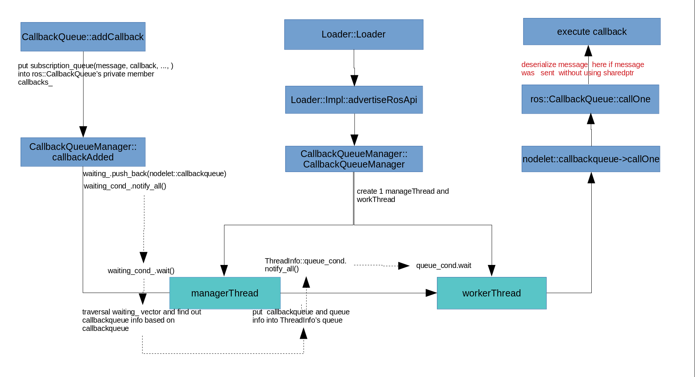

# Roscpp Intra-process Event Notification

## Contents

- [Prerequisites](#Prerequisites)
- [Overview](#Overview)
- [Thread Model of Nodelet](#Thread-Model-of-Nodelet)
- [The workflow of Roscpp Intra-process](#The-workflow-of-Roscpp-Intra-process)
  - [Flow chart](#Flow-chart)
  - [Detail Code Analysis](#Detail-Code-Analysis)
      - [Create a subscriber](#Create-a-subscriber)
      - [Publish message](#Publish-message)
- [Sample](#sample)
- [Appendix](#Appendix)


## Prerequisites

This document focuses on roscpp intra-process(Nodelet) communication. Before read below contents, suggest you read previous [**Nodelet investigation report**](https://www.tool.sony.biz/confluence/display/COREPF/CSC+-+Investigation+-+COREPF-10235) to get basic concept of Nodelet.

## Overview

This document describes how to communicate between publisher and subscriber under Nodelet.  

roscpp uses a combination of boost::shared_ptr and RTTI(Run-Time Type Identification) to provide no-copy intra-process message passing. That only applies if the message is passed in as a boost::shared_ptr. Otherwise it currently still requires a serialize()/deserialize(), though it will skip the transport layer (Refer to [Flow chart for without using shareptr](#Flow-chart-for-without-using-shareptr)). (There is a sample. Please refer to [**sample**](#sample) section)

## Thread Model of Nodelet

Nodelet has 2 methods to run (Refer to [How nodelets work](https://www.tool.sony.biz/confluence/display/COREPF/CSC+-+Investigation+-+COREPF-10235#CSC-Investigation-COREPF-10235-Hownodeletswork)). Threads of Nodelet is created in **nodelet::detail::CallbackQueueManager**. CallbackQueueManager is used in both methods. Use manager/load method to explain how CallbackQueueManager is created and what is done. 

  

  - With the Nodelet manager object created, in the constructor of class CallbackQueueManager, the manager thread and serval work threads will be created.

  - While user nodelet is loaded, **ManagedNodelet** is created. in the constructor of ManagedNodelet, nodelet::detail::CallbackQueue is created and call **CallbackQueueManager::addQueue** to add CallbackQueue to **_queue** of CallbackQueueManager (_queue is a map <CallbackQueue*, QueueInfoPtr>. QueueInfoPtr include execution thread information. At this time, it doesn't decide which work thread deal with this queue). 

  - In the **CallbackQueue::addCallback** function (publisher will call this function. Please refer next section), it will put the information(contain message from publisher, callback provided by subscriber and other useful info) saved in class **SubscriptionQueue** into the ros::CallbackQueue::queue_(private member of class ros::nodelet::CallbackQueue).
  
  - In the **CallbackQueueManager::callbackAdded** function, put the nodelet::detail::CallbackQueue in the **waiting_** vector, then notify managerThread by condition variable **waiting_cond_**.

  - In the managerThread, it traversal the **waiting_** vector to get nodelet::detail::CallbackQueue. And then in _queue of CallbackQueueManager, find execution thread information (QueueInfoPtr) based on CallbackQueue. If QueueInfoPtr not include execution thread information (first time to execution), choose one work thread (ThreadInfo) and record thread information to QueueInfoPtr. If QueueInfoPtr includes execution thread information (QueueInfoPtr), get thread information (ThreadInfo). Finally push nodelet::detail::CallbackQueue into the queue of ThreadInfo(each worker thread has its own ThreadInfo structure to save related information) and notify work thread through condition variable **queue_cond**.

  - Worker threads call the nodelet::detail::CallbackQueue::callOne function
      ```
      nodelet::detail::CallbackQueue::callOne()
        --> ros::CallbackQueue->callOne()
        --> ros::CallbackQueue->callOneCB()
        --> ros::SubscriptionQueue::call() <== Call callback() of subscriber with message from publisher.
      ```


## The workflow of Roscpp Intra-process

### Flow chart

  
Notice: if you want to check the workflow for without using shareptr, please refer to [Flow chart for without using shareptr](#Flow-chart-for-without-using-shareptr).

- When user Nodelet library is loaded, Nodelet manager will load it.
  - Create nodelet's `nodelet::detail::CallbackQueue`(st_queue, mt_queue) while create `ManagedNodelet`
  - In Nodelet::init function, set the callbackqueue.    
    ```cpp
    private_nh_->setCallbackQueue(st_queue);
    nh_->setCallbackQueue(st_queue);
    mt_private_nh_->setCallbackQueue(mt_queue);
    mt_nh_->setCallbackQueue(mt_queue);
    ```
  - Call user's **onInit()** function, which will create a publish/subscribe handle.

- In the **TopicManager::advertise()** function, the Publication object will be created based on the publisher's options. In the **TopicManager::subscribe()** function, the Subscription object will be created based on the subscriber's options.

- The Publication object manages N SubscriberLink objects. Each SubscriberLink is connected to a subscriber on that topic. The Subscription object manages N PublisherLink objects. Each PublisherLink is connected to a publisher on that topic.

- After the message is published, messages and other useful information(callback, etc) will be put into the deque of class **SubscriptionQueue** through the **Subscription::handleMessage()** function, then it will be put into the nodelet's `CallbackQueue` and the thread was woken up to handle the tasks in the `CallbackQueue`(Refer to description in [Thread Model of Nodelet](#Thread-Model-of-Nodelet)).

### Detail Code Analysis

#### Create a subscriber

- NodeHandle::subscribe()

- TopicManager::subscribe()

  - store topic, callback of subscribe, nodelet::detail::CallbackQueue and other information in `Subscription::callbacks_`
    ```
    ...

    CallbackInfoPtr info(boost::make_shared<CallbackInfo>());
    info->helper_ = helper;           // contain topic, callback, ...
    info->callback_queue_ = queue;    // the queue is st_queue or mt_queue(created when load user nodelet library)
    
    ...

    V_CallbackInfo callbacks_.push_back(info)
    ```

  ......

#### Publish message

- Publisher::publish()

- TopicManager::publish()

- Publication::publish()
    - Find the IntraprocessSubscriberLink in this Publication, if any
    
    - Directly enqueue a message to it, only allowing "no-copy" publication

- IntraprocessSubscriberLink::enqueueMessage()

- IntraprocessPublisherLink::handleMessage()

- Subscription::handleMessage()
  - For each subscriber, checks if the RTTI(Run-Time Type Identification) info matches. If so, add the message to its subscription queue.

  - extract information (include callback of subscribe, nodelet::detail::CallbackQueue) from `Subscription::callbacks_`, put it and message to into the deque of class `SubscriptionQueue`, then execute Nnodelet::detail::CallbackQueue::addCallback()
    ```
    ...

    CallbackInfoPtr& info = traversal in subscription::callbacks
    
    ...
    
    info->subscription_queue_->push(info->helper_, deserializer, ...); // info->helper_ include callback of subscriber
    
    info->callback_queue_->addCallback(info->subscription_queue_, (uint64_t)info.get());               // the info->callback_queue_ is the nodelet's callbackqueue(saved when execute TopicManager::subscribe function before)
    
    ...
    ```
- nodelet::detail::CallbackQueue::addCallback(`info->subscription_queue_`, ...)

  - invoke ros::CallbackQueue::addCallback, save `SubscriptionQueue` in its private member `callback_` which is ros::CallbackQueue.
  
  - execute CallbackQueueManager::callbackAdded function with nodelet::detail::CallbackQueue.

- CallbackQueueManager::callbackAdded()

  - `waiting_`.push_back(`nodelet::detail::CallbackQueue`)
  
  - Notify manager thread with condition variable

- ManagerThread
	
  - extract `nodelet::detail::CallbackQueue` from `waiting_`, then in _queue of CallbackQueueManager, find execution thread information (QueueInfoPtr) based on CallbackQueue. If QueueInfoPtr not include execution thread information (first time to execution), choose one work thread (ThreadInfo) and record thread information to QueueInfoPtr. If QueueInfoPtr includes execution thread information (QueueInfoPtr), get thread information (ThreadInfo). 

  - Push nodelet::detail::CallbackQueue into the queue of ThreadInfo(each worker thread has its own ThreadInfo structure to save related information) and notify work thread through condition variable **queue_cond**

- WorkerThread

  - extract `nodelet::detail::CallbackQueue` from `queue` of ThreadInfo
	
  - nodelet::detail::CallbackQueue::callOne()

  - ros::CallbackQueue->callOne()

  - ros::CallbackQueue->callOneCB() 

  - ros::SubscriptionQueue::call()
    - extract callback and message stored in `SubscriptionQueue::callback_` before 
    - execute callback of subscribe with message 


## Sample
  
There is nodelet sample provided. It is located at directory **internals/ros-intraprocess**

Please refer to the [RADME.md](./sample/README.md) file for usage. 

The launch file as below, it will create a Nodelet manager, and then create a Nodelet publisher and Nodelet subscriber. The Nodelet will load the publisher and the subscriber into the same process, and the address of the message (sent by the publisher) is the same as the address of the message (received by the subscriber), which means there is no copy message transmission.

```
<launch>

  <node pkg="nodelet" type="nodelet" name="intraprocess_manager"  args="manager" output="screen"/>

  <node pkg="nodelet" type="nodelet" name="Publish" args="load nodelet_intraprocess_publish/Publish intraprocess_manager" output="screen">
      <remap from="/Publish/intraprocess_topic" to="intraprocess_topic"/>
  </node>

  <node pkg="nodelet" type="nodelet" name="Subscribe"  args="load nodelet_intraprocess_subscribe/Subscribe intraprocess_manager" output="screen">
      <remap from="/Subscribe/intraprocess_topic" to="intraprocess_topic"/>
  </node>

</launch>
```

When running the demo, you will see the following phenomenon, print the process ID of the publisher and subscriber here, and the message address is also displayed.

```
$ roslaunch intraprocess intraprocess.launch 
... logging to /home/.ros/log/c98dde70-860a-11ea-b759-509a4c07139b/roslaunch.log
Checking log directory for disk usage. This may take awhile.
Press Ctrl-C to interrupt
Done checking log file disk usage. Usage is <1GB.

started roslaunch server http://cscsh:44989/

SUMMARY
========

PARAMETERS
 * /rosdistro: melodic
 * /rosversion: 1.14.3

NODES
  /
    Publish (nodelet/nodelet)
    Subscribe (nodelet/nodelet)
    intraprocess_manager (nodelet/nodelet)

auto-starting new master
process[master]: started with pid [18058]
ROS_MASTER_URI=http://localhost:11311

setting /run_id to c98dde70-860a-11ea-b759-509a4c07139b
process[rosout-1]: started with pid [18069]
started core service [/rosout]
process[intraprocess_manager-2]: started with pid [18072]
process[Publish-3]: started with pid [18077]
process[Subscribe-4]: started with pid [18078]
[ INFO] [1587719148.403548414]: Loading nodelet /Publish of type nodelet_intraprocess_publish/Publish to manager intraprocess_manager with the following remappings:
[ INFO] [1587719148.404205259]: /Publish/intraprocess_topic -> /intraprocess_topic
[ INFO] [1587719148.404900596]: waitForService: Service [/intraprocess_manager/load_nodelet] has not been advertised, waiting...
[ INFO] [1587719148.417469541]: Initializing nodelet with 4 worker threads.
[ INFO] [1587719148.417811435]: Loading nodelet /Subscribe of type nodelet_intraprocess_subscribe/Subscribe to manager intraprocess_manager with the following remappings:
[ INFO] [1587719148.420058900]: /Subscribe/intraprocess_topic -> /intraprocess_topic
[ INFO] [1587719148.425631287]: waitForService: Service [/intraprocess_manager/load_nodelet] is now available.
[ INFO] [1587719149.430575781]: Publisher : hello world 0, address : 0x7f6c4c000e50, pid : 18072     <---- publish message, message address, publisher process id.
[ INFO] [1587719149.430853210]: Subscriber : hello world 0, address : 0x7f6c4c000e50, pid : 18072     <---- receive message, message address, subscriber process id.  just the same as publish node.
[ INFO] [1587719150.430901694]: Publisher : hello world 1, address : 0x7f6c4c001790, pid : 18072
[ INFO] [1587719150.431004573]: Subscriber : hello world 1, address : 0x7f6c4c001790, pid : 18072
[ INFO] [1587719151.430075482]: Publisher : hello world 2, address : 0x7f6c4c001d60, pid : 18072
[ INFO] [1587719151.430185104]: Subscriber : hello world 2, address : 0x7f6c4c001d60, pid : 18072
[ INFO] [1587719152.430250095]: Publisher : hello world 3, address : 0x7f6c4c0017c0, pid : 18072
[ INFO] [1587719152.430408643]: Subscriber : hello world 3, address : 0x7f6c4c0017c0, pid : 18072

```

## Reference

- [roscpp internals](http://wiki.ros.org/roscpp/Internals)
    
- [nodelet investigation](https://www.tool.sony.biz/confluence/display/COREPF/CSC+-+Investigation+-+COREPF-10235)

## Appendix

### Flow chart for without using shareptr

